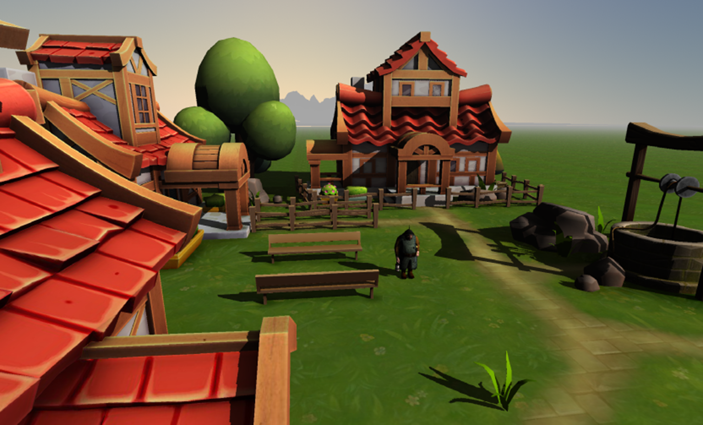
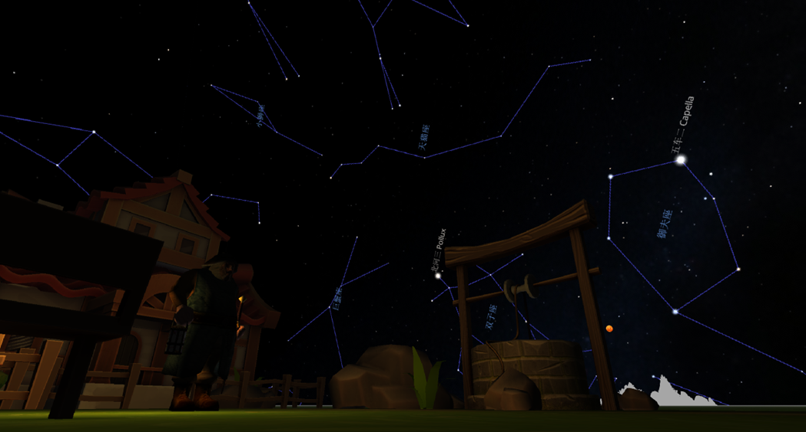
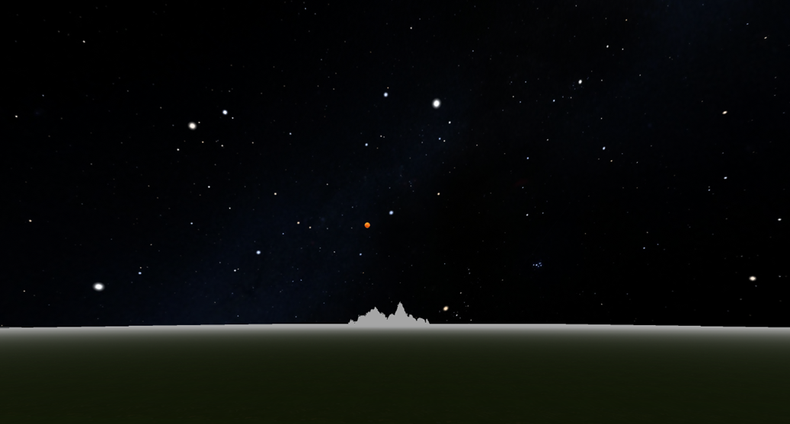

# starVision

**关键词**：java, opengl, game

**用途**：用于计算机图形学课程设计(“观星”场景设计与实现)

**Java 版本**：Java 17

## 图片预览

  
  
  

### 场景切换
- **F1**：村庄
- **F2**：雪地
- **F3**：小岛
- **F4**：山脉

### 星座显示
- **Tab**：切换星座显示

### 雾浓度控制
- **up(↑)**：增加雾浓度
- **down(↓)**：降低雾浓度

### 时间控制与光影变化
- **left(←)**：时间倒退（阳光和物体阴影变化）
- **right(→)**：时间前进（阳光和物体阴影变化）
- **0**：时间恢复默认

### 漫游视角移动
- **w**：向前移动
- **s**：向后移动
- **a**：向左移动
- **d**：向右移动

### 望远镜功能
- **page up**：放大
- **page down**：缩小

### 手电筒功能
- **F**：打开/关闭手电筒

### 音乐
- **M**：打开/关闭音乐

## 程序使用
### 程序主入口
- src/main/java/org/lwjglb/game/Main.java
### 订制天空盒(星座图片)
- src/main/java/org/lwjglb/utils/SkyboxCreator.java

## 参考资料

- [lwjglbook - GitHub](https://github.com/lwjglgamedev/lwjglbook)
- [星空天空盒的获取 - 知乎](https://zhuanlan.zhihu.com/p/377263547)